# 一. 角色篇
按照图鉴顺序排列；名字后括号中显示该英雄外号  

## 黑月众

1. 眉月：  
	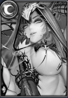  
	立绘好看，攻击敌方物防最低角色，已觉醒，下水道

2. 戴安娜：  
	  
	还算强力的物理输出武者。比较万能的角色，放什么队伍都行，有控制有爆发持续输出也很厉害，还能全队反击，40专能开局晕三个，白嫖可以整一个五星打圣兽狩猎的朱雀和物理元素讨伐，比较推荐放武者队，不过武者队目前下水道，不建议整

3. 露娜：  
	  
	大屁股好看的坦克，坦度一般不过能嘲讽对面全体，未觉醒，目前下水道

4. 魅魔咏美：  
	  
	加能减能控制回血，太杂，已觉醒，下水道

5. 珍妮花：  
	  
	待完善

6. 三上搜查官：  
	  
	强力物理输出，专武开局即能爆发，印记核弹流核心，除非已经有了，不然别碰

7. 剑姬波多：  
	  
	纯魔法输出，加强全队魔法输出，除非超级喜欢，不然别碰，没必要

8. 堕落妖精响（月响/妖精）：  
	  
	最强铁卫，一枝独秀，白嫖可以整一个五星打各个资源。每回合定住对面一排角色，掉血一半禁锢对面全队2回合不能动，低星也可以用，整一个放一号位，其他角色全力输出的队伍也很强力，不过尴尬的地方在于目前顶尖的队伍都不需要铁卫

9. 无邪之罪悠亚：  
	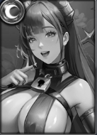  
	打后排有控制的武者，能降低对面50%攻击加眩晕，五星配合30专鬼三，远古可以打满20回合

10. 正义剑客响（剑响/剑客）：  
	  
	目前最强输出之一，白嫖整一个五星打架都猛地一批，比12星普通角色强力太多，修罗队核心，优先打后排，还有免死机制，十分强力，需要摄政女王.比娅，没开大前+50%双免，只要能开大就是胜利

## 日圣教

1. 日光：  
	  
	加攻辅助奶，可以白嫖整一个五星打讨伐，每回合加队伍攻击力最高的角色45%攻击力，优先级很低

2. 多琳：  
	  
	立绘好看，功能性铁卫，打物理队极其强力，白嫖也建议整一个五星多琳，用来打圣兽狩猎的白虎，还能献祭流打波响，只要有队友死了就加全队物免45%一回合自己死也算，开大4个队友分摊伤害并减免45%物理伤害，觉醒以后回合开始就全队套大，基本第一回合全队物理免疫。

3. 吉儿：  
	  
	每回合对面全队套印记，普击有概率连击继续普击，不会触发鬼三连击，已觉醒，下水道，别碰

4. 安多美达：  
	  
	物理防御越高伤害越高的修罗，针对方士不能回血，已觉醒，下水道，别碰

5. 司书圣咏美：  
	  
	魔法队克星，氪佬手上目前最强的铁卫之一，但是不像月响那么全面，每回合都套元素和弱化，给队友抗魔法伤害，降低对面魔法伤害

6. 悠亚酱：  
	  
	偏控制的武者，不强

7. 末日守卫·波多三上（末日/波三）：  
	  
	最强奶妈，一枝独秀，白嫖强烈建议整一个五星，40专全队受到非boss物理伤害不能超过20%血，魔法伤害不能超过30%，防止对面秒人，目前最强40专，所有顶尖队伍都需要一个40专末日

8. 圣龙骑士（圣龙/龙骑）：  
	  
	目前最强工具人，所有人都强力建议至少整一个五星，可以让后排血最少的角色每回合开大，打各种资源都必备，高星给自己开大也可以，自身也是强力输出

9. 露比深田：  
	  
	自身极高的暴击爆伤. 侠客加成. 免疫元素. 概率减能和沉默

10. 托莉维亚：  
	  
	修罗队核心之一，极大的增强修罗的生存能力，还能集火残血

11. 艾蕾娜：  
	  
	待完善

## 云之国

1. 铁华：  
	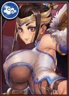  
	白嫖最万能的铁卫前排，受伤给队友回血，但是也是能用的铁卫里最脆的之一，坐等觉醒翻盘，有稳定的获取渠道（许愿和海岛）神器红塔鸟头

2. 银屏：  
	  
	白嫖武者队前排，只能PVP，觉醒后只要前排受伤就减对面能量，只要银屏活着对面很难开大，固定+30%物理减伤，20专20觉就可以用，因为织女的链接减伤，只看受击的单位减伤，基本都是一号位受击，银屏还有嘲讽。

3. 乱菊：  
	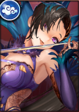  
	已觉醒，下水道，阴阳师杀手，增加对阴阳师的伤害和减能，同时加修罗攻击，不推荐练

4. 花溪：  
	  
	白嫖必练的角色，白嫖打资源必备，对单体角色伤害提升，神器带魔神眼帝释天，坐等觉醒翻盘，PVP下水道

5. 紫铜：  
	  
	平民PVP下水道。打讨伐专用，白嫖最多9星，给后排角色加伤害，觉醒反伤元素伤害，平民神器帝释天。以往氪佬手中的30觉紫铜可放一号位受到伤害就放毒，拥有极高的面板元素伤害100%。不过现在过气了，不推荐练

6. 百琳：  
	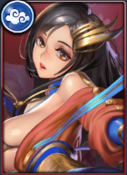  
	白嫖电流队必备，觉醒以后开局就能挂电流，氪佬无视

7. 遮月：  
	  
	电流队核心输出，白嫖抽到可以练，至少比侠客队强力，神器魔神眼，氪佬白嫖都必练角色

8. 香沉：  
	  
	云国专用奶，给云国加伤害，打讨伐打远古都还行，最多9星，不推荐练

9. 幻璃：  
	  
	打资源专用角色，PVP稍弱，没有银屏没有妖精可以勉强当武者队前排，30专20觉打讨伐和远古必备，加物理伤害，还加武者暴击，还能元素讨伐帮丽贝卡挡BOSS印记消除

10. 秘术使响（秘响）：  
	  
	限定角色，目前最弱老师之一，弱化老师，每回合弱化对面4个降低攻击，30专武降低对面30%物理减伤，弱化队里伊迪斯的上位代替，也可以配合波响，神器红塔，也可以带远吕智的魔血烈酒（葫芦），因为对面前排开大就能开大，开大驱散对面全队三个祝福，同时深响能给修罗加能量，有一定的配合

11. 波多与响儿（波响）：  
	  
	限定角色，CH开始破坏游戏平衡的第一个角色，一个波响就是一个队伍，1V5的代表，整一个波响就可以吊打一切白嫖，30专武波响100%闪避普击，受到普击会反击对面5个角色，最多4次，第一回合基本所有角色都只能普击，所以波响放一号位第一回合能对对面反击5*4=20次普击！神器带魔神的赎罪凝视（魔神眼）氪金老师第一30专的角色。万象推荐鹰眼，鹰眼暴击减能8点，让对面开不了大

12. 雅芙·波多：  
	  
	氪金老师，电流队核心之一，PVE输出大核，电流队有了雅芙就不用凯瑟琳，神器魔神眼。PVE打资源极其强力，专武有冰冻效果，可以和朵朵配合，不过速度实在太慢，一般只有电流队带

13. 墨莹：  
	  
	氪金老师，印记队核心，拯救波响的老师，本来波响已经开始走下坡路，靠墨莹硬生生救了回来。专武概率封印对面有印记角色光环，极其强力。能极大的提升侠客输出

14. 白沅：  
	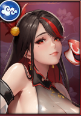  
	待完善

## 蓬莱岛

1. 浅香：  
	  
	燃烧队前排，给燃烧队上buff，还有反击真伤，白嫖狗粮

2. 凛：  
	  
	输出武者，还带控制，白嫖可练丢什么队伍都行，优先度较低，打讨伐和镜像可以用上，白嫖可以拿来打圣兽凤凰

3. 绫乃：  
	  
	白嫖物理爹，白嫖必练，有稳定获取渠道，PVP和PVE都能上场，神器魔神眼，没有就尤弥尔之霜巨角（巨角）

4. 御姬（狐狸）：  
	  
	打魔法元素讨伐都可以上，可放燃烧队，白嫖狗粮，不推荐练

5. 音羽：  
	  
	最强辅助之一，降低对面暴击，针对暴击队，专武加一号位30%物抗，觉醒加血量和回复，元素队给炼金或者紫铜加伤害很强力，必练奶妈，神器红塔

6. 七花：  
	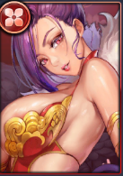  
	蓬莱专用奶，加蓬莱输出，觉醒会给血量低的角色隐匿，很容易隐匿前排被对面直接打穿，白嫖整个低星打讨伐远古就行，凹4个讨伐都需要20觉七花，因为专武的隐匿效果，能防止boss的各种减攻限制等，给大C更好的输出环境，不过目前可以用夜鸦上位代替

7. 天荷：  
	  
	白嫖弱化队前排，全队加15%魔免，白嫖最肉的坦，30觉以后队伍有人开大就可以减少对面随机角色减少20%真伤，可叠加，调整全队能量，神界远古上场可以打满回合数，不推荐练，白嫖最强前排是妖精，整一个五星都比天河12星有用

8. 千鹤：  
	  
	白嫖下水道，可以开局让对面血最多的不会成为优先锁定目标，有几率让全队绕过一号位打后排，打特定镜像可以留一张五星，大佬30觉试过了，打讨伐和远古都不算顶尖，PVP可以整花活

9. 深田咏美（深田）：  
	  
	第一个氪金老师，时代的眼泪，魔法AOE伤害，最肉阴阳师，数值怪，需要高练度才有用，现在已经落伍了，只能放燃烧队，燃烧队重要度还不如狐狸，神器錠光的燃灯托塔（红塔）要输出就葫芦

10. 桔梗：  
	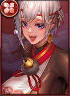  
	目前下水道，很色，9星狗变人玩，玩速度的角色，还有弱化，勉强可以放弱化队，也没有觉醒，说不定未来可期

11. 鬼族三上（鬼三）：  
	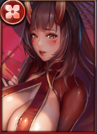  
	氪金老师，最强老师之一，不管PVP还是PVE都是大核，队友普击跟随普击无法闪避，克制波响，丢任何队伍都是大核，死亡还爆发元素伤害，神器魔神眼

12. 大剑豪响：  
	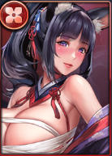  
	目前最弱氪金老师，燃烧队成员，自残加伤害，只能进燃烧队，别碰

13. 亚露茜（茜是多音字，一般读qian，名字使用时一般读xi）：  
	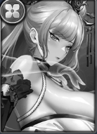  
	限定角色，燃烧队代替七花的奶妈，输出也不低

14. 焰：  
	  
	限定角色，普击AOE对面全队附带燃烧效果，很强力的角色，打讨伐也猛，放元素队也猛的一批，也能放燃烧队

15. 于菟：  
	  
	待完善

## 西方联合

1. 凯瑟琳：  
	   
	前期电流队前排，后面电流队不需要凯瑟琳，自身比铁华肉，打讨伐必备，平时丢英雄石壁，打讨伐拿出来1级一直普击控对面，需要20专+20觉比较好，神器红塔鸟头

2. 奥利维亚（吸血鬼）：  
	  
	下水道，打后排残血收割，别碰

3. 瑞茜（吉他）：  
	  
	目前最强的输出辅助，爆发队必带的辅助，所有爆发队伍都需要，很难取舍，觉醒给三号位加速度和暴击，神器随意，红塔最好

4. 克莱尔：  
	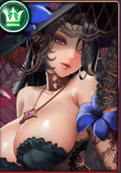  
	下水道，魔法输出，白嫖为数不多的魔法伤害，可以留着打魔法讨伐，直接当狗粮也可以

5. 佩奇：  
	  
	下水道奶，但是全游戏唯一一个清除诅咒的角色，还未觉醒，可以留一个五星打特殊镜像

6. 伊蒂丝（灭霸，因为有个手套）：  
	  
	武者队的奶，白嫖可练放弱化队，神器红塔鸟头

7. 茉莉：  
	  
	白嫖弱化队大核，20觉醒以后才发力，打同级别铁音双老师完全不虚，神器魔神眼上限高，没有就葫芦，还没有就帝释天

8. 伊丽莎白（傻白）：  
	  
	超强的元素伤害，还加全队魔法输出，加防御，打元素讨伐大核，白嫖必留，丢什么队伍都可以，比较万能

9. 希贝儿：  
	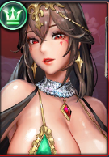  
	白嫖最强的辅助，加全队魔抗，30专后排第一回合加物防50%，打波响特别好用，神器红塔，没有就鸟头

10. 三上歌姬（三上/歌姬）：  
	  
	氪金老师，优先度较低的老师，打资源还行，30专才有大用，优先锁定对面最高攻的角色带队友一起打，后期带神器红塔，没有就鸟头，要打输出可以魔眼狐狸眼葫芦都行，三上专武效果附加的是魔法伤害，所以有些魔法场玲奈和三上一起，玲奈能打不少输出就是因为三上专武效果，三上专武加的魔法伤害，给玲奈等其他配合带加魔法万象比物理万象输出高

11. 织女咏美（织女）：  
	  
	氪金老师，武者队核心挂件，被动所有武者一起分摊伤害，加全队武者伤害，吸血，神器魔眼，因为分摊伤害和减伤没关系，带红塔没用，带魔眼可以多吸血输出

12. 克莉丝朵（朵朵）：  
	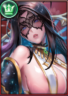  
	限定角色，只能氪金获得，元素输出大核，还能打后排，最强角色之一

13. 渡鸦女王响（渡鸦）：  
	  
	氪金老师，人权卡，所有人能整都建议整一个，保护后排及其强力，每2回合隐匿后排全部，打讨伐必备，修罗队辅助

14. 黛尔娜：  
	  
	限定角色，一拳超人，开局就开大，对面没有40末日，很容易直接无了，及其强力，自身免疫控制，可以搭配朵朵兽耳，能打一切没有40末日阵容

15. 葛瑞丝：  
	  
	待完善

## 部落

1. 梅克纳（牛牛）：  
	  
	部落队唯一铁卫，下水道，爬塔可以整一个9星10专，通关后可以吃了

2. 吉妮西丝（斧头）：  
	  
	下水道，白嫖可以整个九星前期过度，以后可以吃了   

3. 劳拉：  
	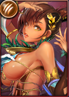  
	混合伤害，卷讨伐和远古好使，但是需要高练度，白嫖不建议优先整

4. 艾玫妮（蛇女）：  
	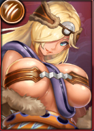  
	元素讨伐必备，还有禁疗，打某些镜像会用到，神器帝释天

5. 阿米那（柱子）：  
	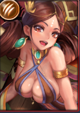  
	部落奶，30专质变，每回合可以一个队友开大，白嫖优先级很低，

6. 丽贝卡（大头，曾经的图标头很大）：  
	  
	元素讨伐可用，部落远古可用，神器帝释天

7. 妮蒂亚（石女）：  
	  
	元素和魔法讨伐必备，加魔法伤害，收到魔法aoe可以石化对面，PVP可以用来控制对面魔法输出，元素队也可以上

8. 波多拉比（波比/兔子）：  
	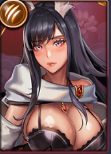  
	氪金老师，电流队核心，开局爆发很猛，神器魔神眼

9. 西娅：  
	  
	目前白嫖最强单体输出，弱化队大核，丢啥队伍都行，白嫖必练，神器葫芦魔眼都行帝释天也行

10. 炼金双星·深田与响（深响/炼金）：  
	  
	优先度很高的氪金老师，能够清除buff，输出也高，能配合任何队伍，每2回合清除对面强化，能够驱散吉他所有强化，还能驱散音羽专武加护甲率的防爆。30专武+40%攻击，免疫诅。只需要五星就能发力，很划算的老师

11. 摩羯波多：  
	  
	氪金老师，最弱老师之一，反伤对面受到我方部落受伤角色攻击力的元素伤害，部落队老师或者配合剑姬波多，摩羯普击转化打2，取消普攻了，所以不触发鬼三的追击，只有大招能触发鬼三追击。剑姬波多可以让摩羯每次普击打3，不会触发鬼三追击。

12. 莫西娅：  
	  
	氪金老师，控制型武者，鬼三弱化版，也会追击，输出控制都强

13. 菲比：  
	  
	待完善

# 二. 阵容篇
太多各种各样的阵容了，只展示大众主流的阵容
1. 修罗队：炼金. 40专末日. 渡鸦. 剑响. 托莉维亚
   修罗菜刀队砍翻一切！修罗魔抗高，剑响需要摄政女王.比娅，只要剑响能开出大招就能翻盘
2. 开局爆发一拳超人队：黛尔娜. 朵朵，兽耳，妖精. 末日
   只要对面没有40末日，都能打
3. 印记队：波响. 40专末日. 三上搜查官/朵朵/鬼三. 吉他. 墨莹
   顶级爆发队，进入战斗前三上搜查官先手爆发，顶级大佬还没进入战斗就结束了，墨莹概率封印对面光环，波响收割，吉他加强爆发
4. 电流队：吉他. 40专末日/龙骑. 三号位遮月. 雅芙. 波比
   
   顶级爆发队，讲究开局爆发，一回合结束战斗，龙骑哪怕五星都可以，控制血量给雅芙开大，雅芙因为被动的原因，还是魔眼，不用葫芦
   白嫖电流队：凯瑟琳，吉他，遮月，百琳，傻白/香沉
   白嫖电流队比毒刀弱化队差点，但是也比侠客队好
5. 元素队：妖精/炼金. 40专末日. 朵朵. 露比. 傻白/渡鸦/鬼三/焰/希贝儿/石女
   强度T1.5，高贵的元素伤害，但是因为打不过波响，被天克，强度下降
6. 武者队：黛尔娜/妖精，40专末日/音羽，鬼三/莫西娅，戴安娜，织女
   强度T2，能打能抗，织女的存在一号位红塔给全队减免。
   前期可以鬼三一号位，毕竟一号位经常被晕被沉默，鬼三一号位不怎么影响输出，而且鬼三一般都是练度最高的，最肉，鬼三死了还可以直接元素爆发
7. 燃烧队：浅香. 亚露茜. 40专末日. 焰，剑豪/深田/鬼三
   强度T2，氪金量T1，能打能抗能回血，强度被拉起了一点，氪佬有多余资源玩玩可以
8. 单波响队：波响，吉他，炼金，鬼三，戴安娜，多琳，希贝儿，音羽等等，太多角色可上
   强度T2，单波响就能吊打一切白嫖。波响队伍基本几种思路，一种增益波响爆发，但是容易被针对；一种就是带另一个大核，双核保险，比如武者或者电流；还有一种是当另一个队伍的前排挂件。可以五星多琳献祭打内战. 可以带炼金消除对面buff. 带吉他增加爆发. 带音羽防止对面暴击. 带希贝儿保后排打内战. 可以带戴安娜，织女加强鬼三. 带30专秘响降低对面输出和防御和三上，炼金组成波响修罗队. 带波比增加开局爆发. 带波三增加BUFF等等，太多替换的了，还可以直接弱化队等队伍前排直接换波响
9. 弱化队：妖精，希贝儿，伊迪斯，茉莉，西娅
   目前白嫖最强的队伍，吊打同级别旧老师队伍（铁华，音羽，深田，三上，玲奈这种铁音双老师队）
10. 白嫖国家队：铁华，音羽，吉他，玲奈，花溪
全都有固定获取渠道，非洲白嫖用来平240级最佳选择
其他还有各种根据自己角色变动的队伍，就不一一举例了

# 三. 远古战场
传说女神全部上响女神，龙骑buff角色带葫芦，其他全部魔眼
1. 云国远古：龙骑，优先高星剑响/可以五星无罪悠亚，雅芙，吉他，鬼三
2. 蓬莱远古：龙骑，优先高星剑响/可以五星无罪悠亚，雅芙，吉他，鬼三
3. 西方远古：龙骑，优先高星剑响/可以五星无罪悠亚，雅芙，吉他，鬼三
4. 部落远古：龙骑，优先高星剑响/可以五星无罪悠亚，雅芙，吉他，鬼三

# 四. 联盟讨伐战
（只做参考，并不是大佬们的最高输出配置，没有老师的用自己阵容的输出替换）
## 野兽哥布林（魔法讨伐
1. 一队：一号位凯瑟琳（神器带1到3级狐狸眼，没有就把等级重置为2级，为了稳定控制），龙骑（神器随意），炼金深响（神器魔神眼），玲奈（神器魔神眼），三上（神器魔神眼）没有三上不要上玲奈，用其他魔法输出替换三上和玲奈
   玲奈攻击要调整的比三上和炼金深响低，进图玲奈专武加攻击，炼金深响加更多，所以面板玲奈可以比炼金深响高一点，进图注意看对面打不打玲奈，女神带响女神，每5回合会加一次攻击，别加给到玲奈吸引对面打玲奈就行，凹的就是这个几率。
2. 二队：深田（神器葫芦/魔神眼），波三，希贝儿，音羽/高星月妖精响，铁华/凛（被晕的）除了深田，其他全部肉起来
   深田大概能打70M+，因为BOSS血越少伤害越高，所以很难打更高的输出，没有深田用其他魔法输出，狐狸克莱尔之类的
3. 三队：一号位波响（30专闪避的，没有可以其他肉），二号位傻白加魔法输出，石女，劳拉/花溪/克莱尔，戴安娜（没有波比就换其他魔法输出花溪等，比如五星戴安娜，上五星日光加伤害等）
   全队只要输出不需要肉度，波响傻白可以裸装
4. 四队：一号位波比，二号位吉他，三号位遮月，摩羯，剑姬
   全队只要输出不需要肉度
## 巫师哥布林（物理讨伐
1. 一队：铁华，希贝儿，茉莉，凛，
   神器带葫芦或者帝释天，因为无法暴击，凛是为了晕BOSS
2. 二队：波响，日波三，音羽，希贝儿，铁华
   波响能打上百M，波响魔神眼，其他肉起来，主要是奶和肉，不需要上香沉日光给波响加输出，女神最好防御女神，没有波响就其他物理输出玲奈等茉莉西娅
3. 三队：织女或者戴安娜一号位吃幻璃的加攻buff，吉他，鬼三，幻璃，织女
   全队神器输出，响女神，要注意鬼三攻击不能全队最高，要注意一号位不是血量百分比最低时，吃不到幻璃的加攻，就有可能导致boss的弱化攻击给到鬼三，注意看鬼三头上有没有一个蓝色的图标，其他都是红色，很明显，带帝释天加的攻击比所有红神都多，帝释天是个好东西
4. 四队：炼金，龙骑，花溪，玲奈，秘响/茉莉等
   炼金消除对面buff，上茉莉就龙骑给茉莉开大
## 机械哥布林（魔法讨伐
1. 一队：深田一号位，凛，音羽，希贝儿，末日
   深田大概能打70M~110M，深田魔神眼，其他肉起来，凛3级狐狸眼或者满级狐狸眼打控制，高配12星月响也能打40M以上，女神最好防御女神，没有深田就用克莱尔狐狸之类
2. 二队：龙骑，劳拉，吉他，三上，花溪/克莱尔
   花溪能打上百M，三上10M~20M，劳拉给花溪加伤害，花溪葫芦，控制后排血量最低让龙骑每回合给花溪开大
3. 三队：凯瑟琳，剑姬波多/紫铜，波比，遮月，朵朵
   凯瑟琳3级狐狸眼以下，或者等级重置到2级打控制，全队神器输出，女神响女神，遮月能打10M到30M，波比能打10M到100M
4. 四队：炼金，摩羯，傻白，石女，织女/剑姬波多/大头/月响
   炼金消buff，五星都行，摩羯给炼金上buff，全队输出，大概打20M~40M左右
## 巨魔哥布林（元素讨伐
1. 一队：波响，柱子，大头/石女，莫西娅，西娅
   或者大头和幻璃
   一队boss降低90%治疗量，但是铁华的被动回血不受限制。boss能清除大头印记，幻璃30专可以帮大头挡一下。输出全部帝释天，因为元素无法暴击，帝释天比魔神眼好。铁华可以红塔鸟头
2. 二队：傻白，希贝儿，七花，石女/织女，克莉丝朵
   主C傻白带葫芦，上了七花就上狐狸。其他没输出的裸装备都行，10回合固定死，肉和输出都没有用的情况下，裸装都行。
   织女配合傻白冰冻，紫铜一号位大概能打10M~60M，傻白能上百M，石女能10M到60M，织女不到10M
3. 三队：多琳，日波三，深田，司书圣咏美，戴安娜
   或者低配：深田，希贝儿，狐狸，五星戴安娜，五星司书圣咏美
   全队帝释天，因为无法暴击，伤害基本固定，很少变动
4. 四队：蛇女一号位，柱子/龙骑，西娅，摩羯，劳拉>波比>日光
   蛇女葫芦，其他帝释天

# 五. 万象
万象附魔无脑选防护，加双免，有鹰眼可以留一下给波响，万象附魔和刻印技能在远古. 讨伐. 主线. 爬塔和镜像等打资源的地方全都无效
# 六. 英灵
氪佬专属，类似装备，有不同的技能效果
# 七. 机械异域
目前氪金加属性和战力最划算的就是机械异域
交谈的选项：30好感前选喜好，31到60选理想，61到100选爱情，没有该选项就点击别的界面，再回交谈刷新
CG谈话选项哪个都行
前几个机器人加的属性都一样，高级机器人加的属性更多，但是要的碎片也更多
# 八. 逐鹿荒野
主力队伍集中在一起，别分散
# 九. 争霸战
1. 争霸的一个冷门小技巧，争霸结束以后，再次点开争霸，打开自己家，可以点赞主城，有100军功，这100计算到拿红旗的5000军功里面的，有时候就差这一点拿红旗
2. 军功邮件还可以留到下一期，这样下一期更好的拿旗子
3. 旗子可以随便升级，分解返还所有资源，最好的属性就是+15%物理/魔法伤害减免，元素伤害正常人打架遇不到，毕竟元素伤害太过高贵
# 十. 女神
1. 普通女神
   90级以内4个普通女神都一样，突破90级以后军神打架最厉害，兽神加攻击卷资源，可以在异界换女神盒子随机碎片，祭典偶尔也会出
2. 传说女神
   目前打资源最厉害的是响女神，打架也强，破坏神PVP最厉害，加双免。各个传说女神都有特殊的点，结衣免疫控制，破坏神免疫晕眩，咏美免疫诅咒，响女神免疫减能. 偷取。一般优先整响女神就行，顶级氪佬随意

# 十一. 专武材料

1. 普通专武材料消耗图（由奶子姐制作）  
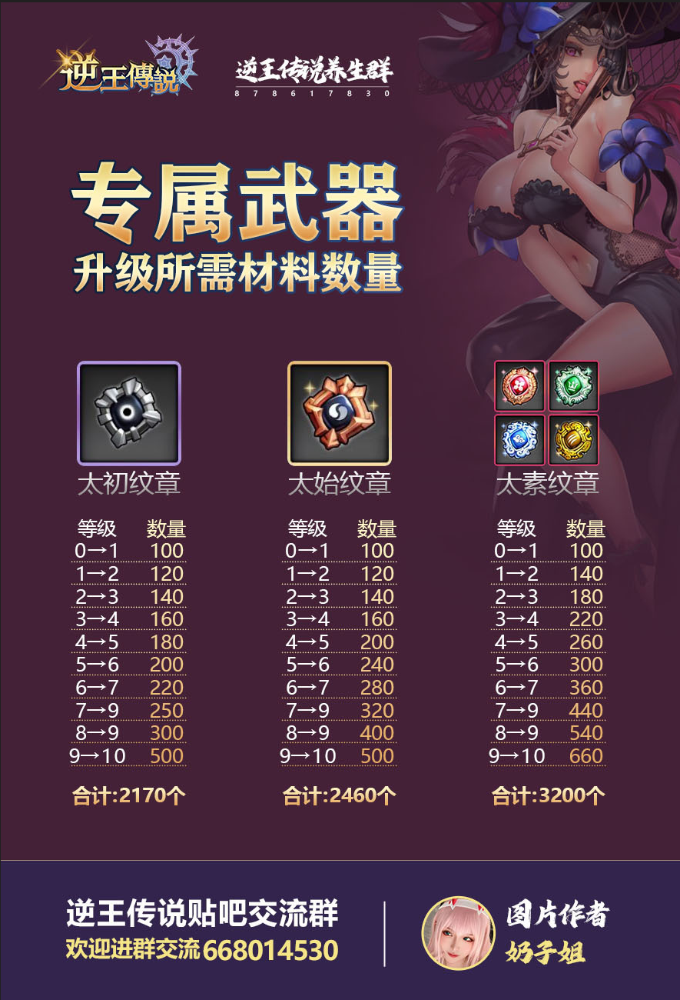

2. 推油消耗图（由44区大佬max整理）  
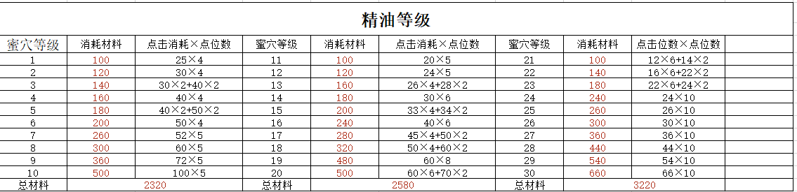

3. 觉醒材料升级表（不知道哪位大佬整理）  
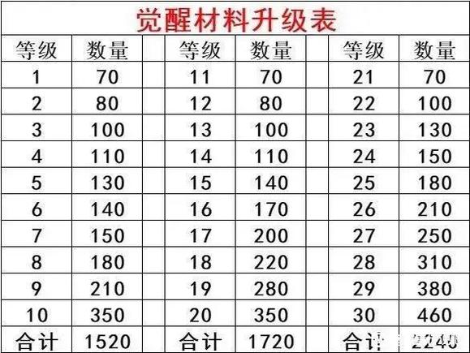

# 十二. 游戏术语
1. 主动技能：普通技能（每2回合发动一次）必杀技（能量满了发动）
   常驻技能：被动技能和战场光环
2. 游戏词条：
   速度：每回合决定敌我行动顺序，也包括战场光环发动先后，速度一样则随机
   命中率：决定英雄普通攻击的命中率
   回避率：能抵消对方的命中率
   护甲率：能抵消对方的暴击率
3. 游戏伤害分为：
   元素伤害：冰冻. 燃烧. 毒素. 电流. 无属性（没有备注是什么伤害，又没说物理. 魔法和真伤的就是无属性）
   物理伤害
   魔法伤害
   真实伤害：不能被任何减伤. 防御效果抵消
4. 祝福：伤害减免（提升三种伤害减伤率）. 强化（各种基础属性提升）. 免疫（不受指定效果影响）. 隐匿（不会优先成为目标）. 护卫（替队友承伤）. 圣盾（指定英雄一起承伤）. 刚盾（额外生命值）. 刺盾（反伤）. 守护（减伤）. 护盾（指定队友加额外生命值）
5. 诅咒：受伤加深（减少三系减伤）. 弱化（各种基础属性降低）. 阻隔（是指定单位不能收到指定效果）. 印记（承受制定元素伤害）. 转移（指定角色基础属性转移到自身）. 恶堕（受伤增加）
6. 控制：晕眩（不能行动）. 麻痹（不能普击）. 沉默（不能使用主动技能，角色1,2一般都是主动技能）. 石化（不能行动，但是物理减伤增加）. 嘲讽（强制攻击）. 停顿（不能行动）. 魅惑（指定攻击强制锁定队友）. 酩酊（使目标效果回合数延长）. 寂静（不能用主动）
7. 补给：治疗（回血）. 恢复（回血）. 偷取（偷取目标生命或者能量给自身）. 吸收（受影响单位承伤以后恢复该伤害百分比生命）. 赋能（回能量）. 生辉（低于一定百分比，恢复生命）
8. 消除：净化（清除指定效果）. 驱散（清除指定效果）. 减能（减少能量）. 奉献（扣除自身生命）

# 十三. 海岛多币路线图二

（由奶子姐制作）  
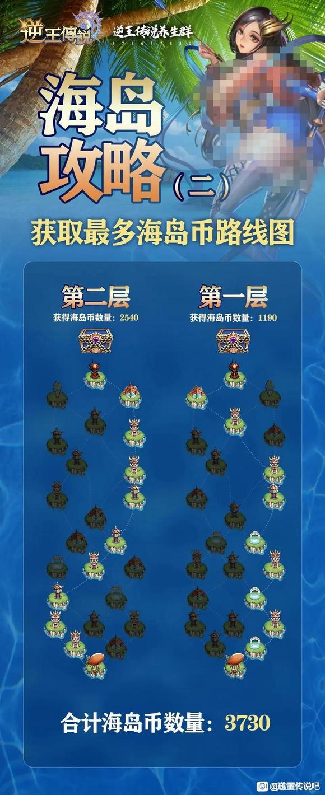

# 十四. 机器人信物消耗

机器人消耗信物，金色女神数量翻倍（不知道哪位大佬整理）
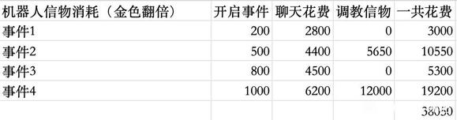  

