# <h1 id="角色篇">一.角色篇</h1>
按照图鉴顺序排列；名字后括号中显示该英雄外号  

## 黑月众

1. 眉月：  
	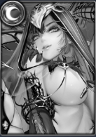  
	立绘好看，攻击敌方物防最低角色，已觉醒，下水道

2. 戴安娜：  
	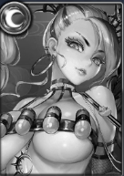  
	还算强力的物理输出武者。比较万能的角色，放什么队伍都行，有控制有爆发持续输出也很厉害，还能全队反击，40专能开局晕三个，白嫖可以整一个五星打圣兽狩猎的朱雀和物理元素讨伐，比较推荐放武者队，不过武者队目前下水道，不建议整

3. 露娜：  
	  
	大屁股好看的坦克，坦度一般不过能嘲讽对面全体，未觉醒，目前下水道

4. 魅魔咏美：  
	  
	加能减能控制回血，太杂，已觉醒，下水道

5. 珍妮花：  
	  
	强度适中，低星可靠链接与束缚当辅助使用，三十专后印记目标行动会回血的能力可以当肉盾使唤并且受击给对面挂印记可以第二回合直接束缚对面给队友制造输出环境；有点小bug：一技能不触发、束缚可对旧版本boss生效，但不影响使用

6. 三上搜查官：  
	  
	物理输出，专武开局即能爆发，印记核弹流核心，除非已经满星，不然别碰

7. 剑姬波多：  
	  
	纯魔法输出，加强全队魔法输出，除非超级喜欢，不然别碰，没必要

8. 堕落妖精响（月响/妖精）：  
	  
	旧时代高强铁卫，每回合定住对面一排角色，掉血一半禁锢对面全队2回合不能动，低星也可以用，整一个放一号位，其他角色全力输出的队伍也很强力，不过尴尬的地方在于目前顶尖的队伍都不需要控制类铁卫，除非骨折出售不推荐获取

9. 无邪之罪悠亚：  
	  
	打后排有控制的武者，能降低对面50%攻击加眩晕，五星配合30专鬼三，远古可以打满20回合

10. 正义剑客响（剑响/剑客）：  
	  
	旧时代的高强输出，五星比12星普通角色强力太多，满星是修罗队核心，优先打后排，还有免死机制，略微强力，不过放到目前版本不是打骨折出售不推荐获取

11. 莉莉安：  
	  
	低星即可，PVP强度略佳；没有锁血角色的情况下就是弟弟；

12. 曹操（佩琪替位）：  
	  
	pve一把好手，打架这方面的话对于修罗来说一般得满星带一套满级红万象才能出门，低星只能充当一只小小的锁血工具人或者卷卷讨伐远古

13. 梅兰妮：  
	  
	魔法类波响×鬼三/白沅结合体，自身免疫毒素效果近乎天克所有毒素类角色，在能抗第一回合的情况下他技能三沙林效果能克制所有光环效果角色，自身对沙林目标还能造成一段不俗的真伤，大招还能驱散减免，PVP跟PVE皆有出场能力，总结低星能用，但练度越高就越强

14. 大乔：  
	  
	向上有余，向下不足；PVP减免完全无效，抗不了任何微氪中氪以上的伤害；唯一可圈可点的就是他普攻增幅挺高，四十专后每多一段棘甲多150%增伤，配合希莉亚波响这类多段aoe普攻角色，一个普攻打二十亿不是问题；就是速度太慢，很难活到行动的时候；评价给到中下，非月氪过万玩家不推荐拉满，五星或者九星即可

## 日圣教

1. 日光：  
	  
	加攻辅助奶，可以白嫖整一个五星打讨伐，每回合加队伍攻击力最高的角色45%攻击力，优先级很低

2. 多琳：  
	  
	立绘好看，功能性铁卫，打物理队极其强力，白嫖也建议整一个五星多琳，用来打圣兽狩猎的白虎，还能献祭流打波响，只要有队友死了就加全队物免45%一回合自己死也算，开大4个队友分摊伤害并减免45%物理伤害，觉醒以后回合开始就全队套大，基本第一回合全队物理免疫。当前版本强度略低，不建议培养

3. 吉儿：  
	  
	每回合对面全队套印记，普击有概率连击继续普击，不会触发鬼三连击，已觉醒，下水道，别碰

4. 安多美达：  
	  
	物理防御越高伤害越高的修罗，针对方士不能回血，已觉醒，下水道，别碰

5. 司书圣咏美：  
	  
	魔法队克星，氪佬手上目前最强的铁卫之一，但是不像贝芙丽那么全面，每回合都套元素和弱化，给队友抗魔法伤害，降低对面魔法伤害

6. 悠亚酱：  
	  
	偏控制的武者，不强

7. 末日守卫·波多三上（末日，人称小佩奇）：  
	  
	强者的分界线，一枝独秀，白嫖请绕道走，氪佬强推，40专全队能锁血物理跟魔法伤害避免被秒杀，真伤以下最强辅助 拥有他，你就拥有了面见逆王皇帝的一丝机会 友情提醒，以25年版本的性价比来说，四十专材料也需要一万币起步，既连续做六次的某个特殊活动，如果想速成可以消费两万五到七万币，能怎么省全看你对活动的理解深度，极限是两万五千币

8. 圣龙骑士（圣龙/龙骑）：  
	  
	目前最强工具人，所有人都强力建议至少整一个五星，可以让后排血最少的角色每回合开大，打各种资源都必备，高星给自己开大也可以，自身也是强力输出

9. 露比深田：  
	  
	自身极高的暴击爆伤. 侠客加成. 免疫元素. 概率减能和沉默；全日队核心之一，搭配武则天跟贝芙丽，女神用药神共鸣风神的情况下，或者艾蕾娜搭配170级的风神或者响神，可以不靠末日达到高减伤状态，自身因为免疫元素伤害所以在一号位的时候首回合非真伤能力不会出现减员情况，队伍组成后强度上佳，大氪佬实战对轰部落牛牛队基本稳赢

10. 托莉维亚：  
	  
	修罗队核心之一，极大的增强修罗的生存能力，还能集火残血

11. 艾蕾娜（女武神）：  
	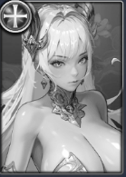  
	氪金女神队核心，进场即可让女神开大招，可根据女神类型组成强力队伍，本身自带首回合五十物理减免与麻痹沉默可随意与除了波响队以外任何角色组成搭配，天克黛尔娜，波响等aoe角色，怕封印，放逐，束缚

12. 贝芙丽：  
	  
	当前最强辅助，有减免有减少有攻击提升有伤害提升，行动时还能治疗队友，pvePVP皆能用

13. 赫蒂：  
	  
	配合珍妮花跟奥蒂莉亚，贝芙丽可以组成高减免减伤的束缚队，本身造成的真伤还能无视对面减免，有高练珍妮花可以养

14. 武则天：  
	  
	辅助类侠客，技能四可以让友方所有日圣教角色打束缚目标时附赠一段真伤，专武激活时可以提升一点队友存活率加魔法受击反真伤，不过这段反伤测试时实际伤害很低，别指望太多，虽然二技能三技能全是增幅队友，但是在当主力时情况不是很理想，全日队核心之一，搭配贝芙丽加上自身四十专效果提供的减伤能力实战中略佳，大招净化能力在PVE也很常用，与佩琪做比较就相当于一个是输出类全体净化，一个是光环类净化

15. 希莉娅：  
	  
	PVP强度挺猛，但非v15氪度的话五星即可

## 云之国

1. 铁华：  
	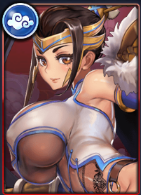  
	白嫖最万能的铁卫前排，受伤给队友回血，但也是用的铁卫里最脆的之一，三十觉过于垃圾，防不住被动伤害，有稳定的获取渠道

2. 银屏：  
	  
	白嫖武者队前排，只能PVP，觉醒后只要前排受伤就减对面能量，只要银屏活着对面很难开大，固定+30%物理减伤，20专20觉就可以用，因为织女的链接减伤，只看受击的单位减伤，基本都是一号位受击，银屏还有嘲讽。

3. 乱菊：  
	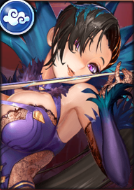  
	已觉醒，下水道，阴阳师杀手，增加对阴阳师的伤害和减能，同时加修罗攻击，不推荐练

4. 花溪：  
	  
	下水道角色，除了角色获取得快一无是处，平等级可以考虑

5. 紫铜：  
	  
	平民PVP下水道。打讨伐专用，白嫖最多9星，给后排角色加伤害，觉醒反伤元素伤害，平民神器帝释天。以往氪佬手中的30觉紫铜可放一号位受到伤害就放毒，拥有极高的面板元素伤害100%。不过现在过气了，不推荐练

6. 百琳：  
	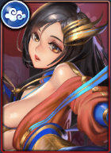  
	白嫖讨伐元素四队必备，觉醒以后开局就能挂电流，可以重复命中一个目标，氪佬无视

7. 遮月：  
	  
	电流队核心输出，白嫖抽到可以练，至少你没得选，神器魔神眼，白嫖最后的荣光，氪佬不必理会

8. 香沉：  
	  
	云国专用奶，给云国加伤害，打讨伐打远古都还行，最多9星，不推荐练

9. 幻璃：  
	  
	打资源专用角色，PVP稍弱，没有银屏没有妖精可以勉强当武者队前排，30专20觉打讨伐和远古必备，加物理伤害，还加武者暴击，还能元素讨伐帮丽贝卡挡BOSS印记消除；因为蓬莱千早问题物理讨伐三队实用性一落千丈，不去一队的话基本下水道

10. 秘术使响（秘响）：  
	  
	限定角色，目前最弱老师之一，弱化老师，每回合弱化对面4个降低攻击，30专武降低对面30%物理减伤，弱化队里伊迪斯的上位代替，也可以配合波响，神器红塔，也可以带远吕智的魔血烈酒（葫芦），因为对面前排开大就能开大，开大驱散对面全队三个祝福，同时深响能给修罗加能量，有一定的配合

11. 波多与响儿（波响）：  
	  
	CH开始破坏游戏平衡的第一个角色，一个波响就是一个队伍，1V5的代表，整一个波响就可以吊打一切白嫖，30专武波响100%闪避普击，受到普击会反击对面5个角色，最多4次，第一回合基本所有角色都只能普击，所以波响放一号位第一回合能对对面反击5 \* 4=20次普击！当然这都是曾经的辉煌，现在下水道，期待觉醒再创辉煌

12. 雅芙·波多：  
	  
	氪金老师，电流队核心之一，PVE输出大核，电流队有了雅芙就不用凯瑟琳，神器魔神眼。PVE打资源极其强力，专武有冰冻效果，可以和朵朵配合，不过速度实在太慢，一般只有电流队带

13. 墨莹：  
	  
	氪金老师，印记队核心，拯救波响的老师，本来波响已经开始走下坡路，靠墨莹硬生生救了回来。专武概率封印对面有印记角色光环，极其强力。能极大的提升侠客输出，觉醒后犹如天上降魔主，微氪太岁神，机器人面板到位，屠杀任何没有锁血机制的氪佬，只有逐鹿前五的那些霸主级别存在可以不靠锁血机制来硬抗，怕甄姬与猎者等能赋予负面效果的英灵或角色等

14. 白沅（白玩）：  
	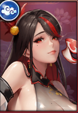  
	如其代号，不拉满的情况下跟白玩一样，唯一可圈可点的就是自身被控制的情况下，对方残血时行动也能追击，专武减闪避纯针对波响，可以跟凌霜做搭配 友情提醒：新版本放逐可以让他无法触发追击

15. 锦雪：  
	  
	每回合百分比扣血扣能量加自身身上让自身可以稳定每回合开大招，并且还能对敌方强制性造成百分比真实伤害，技能四的受击反伤就算是被放逐被束缚等强控也能触发，攻击目标造成全排伤害更是让角色强上加强，直奔PVP阴阳师榜t0

16. 凌霜：  
	  
	带免疫控制英灵的情况下，再给对面挂电流buff，造成的伤害可以秒人，如果再搞点控制类女神例如时间或者抗压类女神例如丰收提升存活率还是可以出门的，缺点就是造价偏高，不推荐微氪，大氪可以养

17. 昭雪：  
	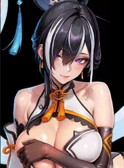  
	赋能兼解控与回血类辅助卡，PVE跟PVP双兼容，平民必备一只在身上，生命值低于百分之三十回复百分之四十五的回血能力搭配锁血角色绝对的强，并且还能净化诅咒跟控制，身上所有功能都没有职业与阵容限制，有能力并且身上有锁血类角色的话可以拉满来用

## 蓬莱岛

1. 浅香：  
	  
	燃烧队前排，给燃烧队上buff，还有反击真伤，白嫖狗粮

2. 凛：  
	  
	输出武者，还带控制，白嫖可练丢什么队伍都行，优先度较低，打讨伐和镜像可以用上，白嫖可以拿来打圣兽凤凰

3. 绫乃：  
	  
	下水道角色，出了获取渠道快之外一无是处

4. 御姬（狐狸）：  
	  
	打魔法元素讨伐都可以上，可放燃烧队，白嫖狗粮，不推荐练

5. 音羽：  
	  
	最强辅助之一，降低对面暴击，针对暴击队，专武加一号位30%物抗，觉醒加血量和回复，元素队给炼金或者紫铜加伤害很强力，必练奶妈，神器红塔

6. 七花：  
	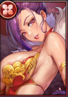  
	蓬莱专用奶，加蓬莱输出，觉醒会给血量低的角色隐匿，很容易隐匿前排被对面直接打穿，白嫖整个低星打讨伐远古就行，凹4个讨伐都需要20觉七花，因为专武的隐匿效果，能防止boss的各种减攻限制等，给大C更好的输出环境，不过目前可以用夜鸦上位代替

7. 天荷：  
	  
	白嫖下水道，氪佬三十觉的情况下物理讨伐一队常驻角色，配合170响神可以削弱boss全部伤害来打满二十回合，截止25年没有平替角色

8. 千鹤：  
	  
	白嫖下水道，可以开局让对面血最多的不会成为优先锁定目标，有几率让全队绕过一号位打后排，打特定镜像可以留一张五星，大佬30觉试过了，打讨伐和远古都不算顶尖，PVP可以整花活

9. 深田咏美（深田）：  
	  
	第一个氪金老师，时代的眼泪，魔法AOE伤害，最肉阴阳师，数值怪，需要高练度才有用，现在已经落伍了，只能放燃烧队，燃烧队重要度还不如狐狸，神器錠光的燃灯托塔（红塔）要输出就葫芦

10. 桔梗：  
	  
	目前下水道，很色，9星狗变人玩，玩速度的角色，还有弱化，勉强可以放弱化队，也没有觉醒，说不定未来可期

11. 鬼族三上（鬼三）：  
	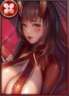  
	氪金老师，曾经最强老师之一，不管PVP还是PVE都是大核，队友普击跟随普击无法闪避，克制波响，丢任何队伍都是大核，死亡还爆发元素伤害，现在勉勉强强还能打打讨伐远古

12. 大剑豪响：  
	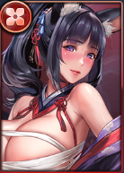  
	目前最弱氪金老师，燃烧队成员，自残加伤害，只能进燃烧队，别碰

13. 亚露茜（茜是多音字，一般读qian，名字使用时一般读xi）：  
	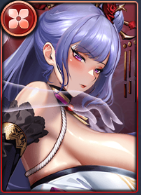  
	限定角色，燃烧队代替七花的奶妈，输出也不低，buff加的很多，方士里前三强

14. 焰：  
	  
	限定角色，普击AOE对面全队附带燃烧效果，很强力的角色，打讨伐也猛，放元素队也猛的一批，也能放燃烧队

15. 于菟（玉兔）：  
	  
	微氪之光，既加能量又削对面减免，专武加攻击的情况下还有概率使物理伤害提升2.5倍，配合龙骑加三侠客大招可一次性打五位，怕控制，减能（可氪某位130女神防减能，但那位女神并不是百分百能防住）

16. 樱咲：  
	  
	PVP造价过高不推荐，并且实战不理想 PVE就捏个三十专炫炫物理讨伐四队跟元素讨伐三队，其他地方不理想 除了皮肤好看之外其他都不太理想；大氪佬别氪，因为三十专效果生命值加的太高无法吃到龙骑效果，导致讨伐成废物，还影响其他角色输出，微氪无所谓，大氪下水道，氪的越多越垃圾

17. 周瑜：  
	  
	非顶氪的情况下PVP只能当个辅助用，PVE方面打元素boss第三队效果不错，死一个队友延长一回合燃烧，打的好可以突破常规阵容上限

18. 孙策：  
	  
	26年上半年内定PVE天花板，大招叠加机制在经过测试后发现叠的是总攻击面板，如果能开二十次大招相当于叠加24倍总攻击面板，配合英灵跟角色可以在PVE方面轻松突破千亿，至于PVP不理想，目前25年版本还没办法组出强力阵容

19. 千早：  
	  
	机制类角色，PVE必备，PVP低星效果可以通过技能三打一些蛇皮队，高星因为大招只打一个目标，所以当主力的情况下实战不佳，也是通过技能三提供输出，专武在实测上也是PVE用的多PVP用的少，总结就是PVE与PVP与曹操属于相似情况，属于低星能用，满星的话带辅助英灵触发效果来陪跑

## 西方联合

1. 凯瑟琳：  
	   
	前期电流队前排，后面电流队不需要凯瑟琳，自身比铁华肉，打讨伐必备，平时丢英雄石壁，打讨伐拿出来1级一直普击控对面，需要20专+20觉比较好，神器红塔鸟头

2. 奥利维亚（吸血鬼）：  
	  
	下水道，打后排残血收割，别碰

3. 瑞茜（吉他）：  
	  
	目前最强的输出辅助，爆发队必带的辅助，所有爆发队伍都需要，很难取舍，觉醒给三号位加速度和暴击，神器随意，红塔最好

4. 克莱尔：  
	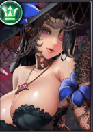  
	下水道，魔法输出，白嫖为数不多的魔法伤害，可以留着打魔法讨伐，直接当狗粮也可以

5. 佩奇（小末日）：  
	  
	曾经的小垃圾，但是觉醒逆天改命，受击时可给攻击最高队友无限叠加攻击（虽然只能持续一回合，并且给速度最慢或者元素角色吃该buff效果才能更佳），十觉pve效果比二十觉更佳，三十觉如同半个末日附体，物理受击锁血还回血，技能还能净化诅咒

6. 伊蒂丝（灭霸，因为有个手套）：  
	  
	武者队的奶，白嫖可练放弱化队，神器红塔鸟头

7. 茉莉：  
	  
	白嫖弱化队大核，20觉醒以后才发力，打同级别铁音双老师完全不虚，神器魔神眼上限高，没有就葫芦，还没有就帝释天

8. 伊丽莎白（傻白）：  
	  
	还加后排魔法输出，加防御，白嫖必留，丢什么队伍都可以，比较万能；氪佬可以无视，讨伐的氪佬阵容用不上

9. 希贝儿：  
	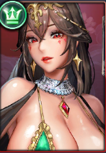  
	白嫖最强的辅助，加全队魔抗，30专后排第一回合加物防50%，打波响特别好用，神器红塔，没有就鸟头

10. 三上歌姬（三上/歌姬）：  
	  
	下水道，勿养

11. 织女咏美（织女）：  
	  
	氪金老师，武者队核心挂件，被动所有武者一起分摊伤害，加全队武者伤害，吸血，神器魔眼，因为分摊伤害和减伤没关系，带红塔没用，带魔眼可以多吸血输出

12. 克莉丝朵（朵朵）：  
	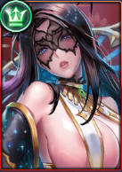  
	限定角色，元素输出大核，还能打后排，辅助能力略佳

13. 渡鸦女王响（渡鸦）：  
	  
	氪金老师，所有人能整都建议整一个，保护后排及其强力，每2回合隐匿后排全部，打讨伐必备，修罗队辅助；因为良性bug被修复，强度一落千丈，半步下水道，不是XP党可以不养

14. 黛尔娜：  
	  
	限定角色，一拳超人，开局就开大，对面如果没有40专末日/30觉佩琪/挂件曹操/偷能锦雪/减能奥蒂莉亚的情况下，很容易直接无了，极其强力，自身免疫控制，搭配响女神，只要不被减能/偷能/被针对，还是能出门的

15. 葛瑞丝（修女）：  
	  
	阴阳师减免队主力之一，前排物理/魔法减免起手可叠好几十，一号位站西方或者阴阳师时，满级带红塔配合贝芙丽与音羽或者减免女神/减免旗帜等可进场百减免起步，怕无视减免或元素与真伤角色

16. 哈娜：  
	  
	搭配响女神助战三上女神可以进场触发技能三全体伤害，如果带墨莹触发暴击给能量还能再开一轮大招，萌新实战效果略佳，对中氪或者老玩家来说强度也是中上；也可以当辅助用给西方提点面板

17. 诸葛亮：  
	  
	高贵西方免疫控制注定让他不会太早落伍，专武的直接伤害追击也能让他在输出上获得不低的造诣，技能四的生命值攻击加成可以让他与任何西方角色做组合

18. 张飞：  
	  
	首位明眼上针对反伤类与追击类角色的限定角色，护卫机制可以让那些反伤类角色与所有角色主动伤害只能造成15%+未转移的20%伤害，并且护卫目标受击还能回复受击角色与张飞本身15%生命值，缺点就是非直接伤害不回血，怕封印与束缚

## 部落

1. 梅克纳（牛牛）：  
	  
	微氪陷阱，顶氪玩物，截止25年热门部落队主力，配合菲比，维尔拉，奥蒂莉亚，米拉，丰收神共鸣时间神与海神，加英灵貂蝉，司马懿，家康等辅助英灵组高减伤队，因为角色专武有加生命值上限，只要不碰到荆轲那种逆天真伤基本可以抗压好几回合，打破逆王界一回合结束战斗的恶劣环境，后续如果新角色搭配上有更好的搭配可以自行调整，月氪能力少于五位数不推荐培养，除非你是老玩家累积资源够多

2. 吉妮西丝（斧头）：  
	  
	下水道，白嫖可以整个九星前期过度，以后可以吃了   

3. 劳拉：  
	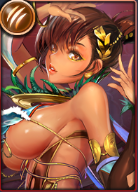  
	混合伤害，卷讨伐和远古好使，但是需要高练度，白嫖不建议优先整

4. 艾玫妮（蛇女）：  
	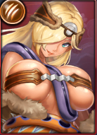  
	元素讨伐必备，还有禁疗，打某些镜像会用到，神器帝释天

5. 阿米那（柱子）：  
	  
	部落奶，30专质变，每回合可以一个队友开大，白嫖优先级很低，

6. 丽贝卡（大头，曾经的图标头很大）：  
	  
	元素讨伐可用，部落远古可用，神器帝释天

7. 妮蒂亚（石女）：  
	  
	元素和魔法讨伐常备角色，受到魔法aoe可以石化对面，PVP可以用来控制对面魔法输出，元素队也可以上，后期实用性略低

8. 波多拉比（波比/兔子）：  
	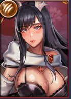  
	氪金老师，开局爆发还行，后期实战效果略低

9. 西娅：  
	  
	目前白嫖最强单体输出，弱化队大核，丢啥队伍都行，白嫖必练，神器葫芦魔眼都行帝释天也行

10. 炼金双星·深田与响（深响/炼金）：  
	  
	优先度很高的氪金老师，能够清除buff，输出也高，能配合任何队伍，每2回合清除对面强化，能够驱散吉他所有强化，还能驱散音羽专武加护甲率的防爆。30专武+40%攻击，免疫诅。只需要五星就能发力，很划算的老师

11. 摩羯波多：  
	  
	氪金老师，最弱老师之一，反伤对面受到我方部落受伤角色攻击力的元素伤害，部落队老师或者配合剑姬波多，摩羯普击转化打2，取消普攻了，所以不触发鬼三的追击，只有大招能触发鬼三追击。剑姬波多可以让摩羯每次普击打3，不会触发鬼三追击。

12. 莫西娅：  
	  
	氪金老师，控制型武者，鬼三弱化版，也会追击，输出控制都强

13. 菲比（老鼠）：  
	  
	高端局近乎最强侠客，配合满级英灵村田信长，队友一死光加自身一触发残血锁血，就是对面的灾难，低端局也能靠大招的超高倍率混日子，或超高暴击加持当辅助，怕黛尔娜（可用曹操或三十觉佩琪或四十专末日抵防）与赫蒂（净化毒素是真的让人破防）

14. 维尔拉（白兔）：  
	  
	数值大户，低端局过于拉闸，数值越高越强，机器人全拉满的情况下随便打对面几下回合结束时都能给对面每人造成数千万元素伤害（逆王皇帝截止2025年10月也才一亿滴血），三十专能有效给自身提供存活率，怕被动普攻伤害跟减攻击buff 元素讨伐一队也是常驻角色，配合高星莫西娅的追击造成的伤害还是不错的

15. 奥蒂莉亚：  
	  
	平民战神，部落最强扛把子，虐波响必备，专门针对老古董波响跟靠一技能大招的角色，怕进场爆发，例如元素角色或者电流印记队等

16. 米拉：  
	  
	低星好辅助，高星好输出，配合丰收神共鸣海神有三个阻隔，相当于进场三段伤害+本身沉默一个目标一段伤害，该机制每一段不同效果可以重复命中同一个，放逐机制在搭配好的情况下堪称必中对面最快侠客，就是石化效果不是很理想，25年热门部落队很少会放一号位挨打触发，不过基本上靠大招毒素目标造成元素伤害打输出，总结中等偏上

# <h1 id="远古战场">二.远古战场</h1>
统一为：龙骑，无邪之罪悠亚/剑客响（九星三十专）二选一，孙策，瑞茜/千早二选一（单纯的辅助），鬼族三上（九星三十专）  
剑客三十专搭配其他角色无法打二十回合，只有鬼三为主的三十专可以搭配其他角色  
女神根据自身需求搭配，截止25年最好是药神共鸣丰收加任一高级旧女神，孙策最好站在后排第一个位置，也就是三号位，如果不懂站位顺序可以一个一个点，游戏会按顺序自动上场  
药神\[被动技能三\]十级的情况下搭配六星九十级英灵猎者阿塔兰塔的毒素目标攻击降低可以平替鬼三以外的另外一位攻击下降角色，相当于可以多上一个辅助类角色  
26年上半年大成阵容：鬼三，雅鹿茜，孙策，玉兔，千早，130级药神\[被动技能三\]十级，满星级猎者阿塔兰塔即可打二十回合

# <h1 id="联盟讨伐战">三.联盟讨伐战</h1>
（只做参考，并不是大佬们的最高输出配置，没有老师的用自己阵容的输出替换）  

留意事项：除元素讨伐之外其他三期讨伐一二队皆无法挂上元素buff，需要元素前提的增伤buff最好留在三四队，常见的有：英灵猎者·阿塔兰塔，英灵司马懿，于菟三十专的燃烧增伤效果，锦雪大招对电流目标效果等  
至于英灵如何搭配就看你自身了解程度了，因为普遍要换来换去所以非必须类其他不会提及  
神器除却个别括号内提及显示以外大部分默认使用红色神器魔神眼或者紫色神器帝释天  
专跟觉的全称叫专武，觉醒，二十专即二十级专武，觉醒同理，位置处于角色九星后装备栏手部位下面那个格子，一般需要九星解锁  
buff的意思是增益效果  
至于减益的话我们一般叫负面buff  
角色站位记得按顺序上，个别没有署名也要按照提名时的大致位置安排，除非全都没有署名就随便上，女神用药神的直接把主力锁死三号位，不懂三号位在哪就一个一个角色点，第三个就是  

## 野兽哥布林（魔法讨伐/野兽讨伐）

1. 一队：通用阵容：凯瑟琳（二十专，等级一级），佩琪（二十专十觉），两个单体技能角色负责抗伤与输出，剩下的位置可以再上个辅助提供伤害增幅  
	女神推荐：药神，响神，雷神等  
	邪门阵容：希贝儿，诸葛亮，哈娜，渡鸦响，张飞  
	女神推荐：响神共鸣三上女神  
	单体爆发推荐：鬼族三上（需要英灵甄洛），诸葛亮，劳拉，三上歌姬等大招一技能都面向一号位顺位或者最大/最小生命值目标的单体类型。  
2. 二队：通用阵容：一到三个群体输出，赫蒂，剩下再上治疗或者增加生命值上限的角色  
	女神推荐：命运神，响神  
	邪门阵容：凛（三十专觉），艾蕾娜（四十专），哈娜，深田露比，剩下可以再上个群体控制  
	女神推荐：响神共鸣三上  
	此阵容全员神器需要带三级以上狐狸眼  
	群体爆发推荐：莉莉安，菲比，哈娜，深田露比，渡鸦响等  
	治疗推荐：末日守卫，贝芙丽，亚露茜，希贝儿等  
3. 三队：通用阵容：奥蒂莉亚/妖精响/波响（三十专）三选一，两个光环类输出，两个辅助  
	女神推荐：无需求  
	光环类输出推荐：墨莹，梅兰妮，戴安娜，遮月，雅芙，劳拉，哈娜，三上歌姬，妮蒂娅，剑姬波多等  
	辅助推荐：瑞茜，伊丽莎白，克里斯朵等  
4. 四队：通用阵容：龙骑波多/贝芙丽（满级狐狸眼）二选一，珍妮花，主力输出，辅助，于菟  
	女神推荐：药神  
	珍妮花于菟不可平替，龙骑需要赋能主力输出  
	邪门阵容：千早（满级狐狸眼），珍妮花，孙策，亚露茜，于菟  
	女神推荐：药神  
	该阵容前提条件需要三星以下的垃圾角色拥有九十万攻击显示面板，即你最强角色要有一百七十多万以上攻击面板，外加英灵全部满星九十级才能使用，如果你有两百四十万以上攻击面板可以将亚露茜换成其他蓬莱辅助，仅限蓬莱  
	输出推荐：孙策，亚芙，锦雪，菲比，维尔拉等  
	辅助推荐：千早，瑞茜，伊丽莎白，佩琪等  

## 巫师哥布林（物理讨伐）

1. 一队：通用阵容：赫蒂，武则天，搭配三个物理输出  
	邪门阵容：哈娜（高级狐狸眼），赫蒂，于菟，龙骑波多，墨莹  
	女神推荐：药神，雷神等  
	龙骑赋能于菟，女神不推荐使用响神（有风险，非资深玩家不推荐）  
	邪门阵容：哈娜（满级狐狸眼+满星级毒蝎英灵），一个强控，一个主力输出，两个辅助  
	邪门阵容二：凌霜，幻离，天荷（三十专觉），艾蕾娜（四十专），武则天  
	女神推荐：响神（需要满级）  
	输出推荐：不挑  
2. 二队：通用阵容：一或两群体爆发，两个治疗或者生命值上限，剩下随便辅助  
	女神推荐：不挑  
	输出推荐：剑客响，戴尔娜，张飞，茉莉等  
	治疗推荐，希贝儿，末日守卫，铁华（二十专）等  
	辅助推荐：珍妮花，诸葛等  
3. 三队：通用阵容：四个伤害增幅类辅助鬼三（英灵推荐米诺英灵）或者孙策（需要满星级亚瑟英灵，否则会被闪避攻击）  
	女神推荐：药神，商业，命运等  
	辅助推荐：曹操，千早，幻璃（三十专），戴安娜（四十专觉），悠亚酱（四十专觉），莫西娅（三十专带司马懿英灵），七花，周瑜等  
4. 四队：通用阵容：龙骑波多，音羽，于菟，墨莹，瑞茜  
	女神推荐：商业，命运等  
	要求龙骑赋能于菟，该阵容属于相辅相成，于26年上半年时期还无法平替其中任意角色，强行替换其中角色会导致伤害少三成起步，只能期待后续新角色  
	邪门阵容：吉儿（需要速度比于菟快），艾蕾娜（四十专），于菟，墨莹，瑞茜  
	女神推荐：满级响神  

## 机械哥布林（魔法讨伐）

1. 一队：通用阵容：希贝儿，末日，哈娜，诸葛，赫蒂  
	女神推荐：响神  
	如果你主力哈娜练度星级不高或者没有诸葛并且打算上其他高星角色的话需要上一个速度快的角色挡住眩晕，因为诸葛可以免疫西方全体控制，其他阵营免疫不了  
2. 二队：通用阵容：全上修罗阵营角色，核心是托利维亚与渡鸦响，一般是炼金，曹操，托利维亚，渡鸦响，三上歌姬（三十专）  
	女神推荐：时间，商业，命运等  
	歌姬可以用其他修罗平替，不是刚需，如果没有就放弃这一队，这一队伤害不是很重要  
	邪门阵容：莉莉安，末日，音羽，佩琪，菲比  
	女神推荐：同上  
	该阵容在一千万生命值之前不推荐使用  
3. 三队：通用阵容：珍妮花，于菟，孙策，墨莹（二十专觉），龙骑  
	女神推荐：药神，时间，商业，命运等  
	龙骑赋能孙策，珍妮花，玉兔，孙策不可平替  
	后期阵容：珍妮花，于菟，孙策，亚露茜，千早  
	女神推荐：同上  
	大概三星角色面板有七十万左右时就可以硬抗BOSS倒数第三回合伤害了  
4. 四队：通用阵容：龙骑，瑞茜，输出，俩辅助  
	女神推荐：不挑  
	邪门阵容：锦雪，贝芙丽（回血戒指），亚芙，菲比，艾蕾娜  
	女神推荐：高级响神  
	练度高点可以试玩邪门点的  
	输出推荐：锦雪，雅芙，菲比等  
	辅助推荐：雅芙，奥蒂莉亚，菲比，佩琪，伊丽莎白，克莉丝朵等  

## 巨魔哥布林（元素讨伐）

1. 一队：通用阵容：珍妮花，辅助，丽贝卡，辅助，辅助  
	女神推荐：时间神  
	珍妮花与丽贝卡不可平替  
	辅助推荐，艾蕾娜（四十专），渡鸦响，维尔拉，莫西娅（需要维尔拉在场），克莉丝朵，妮蒂娅等  
2. 二队：通用阵容：伊丽莎白，音羽，雅芙，末日，剩下随便上个辅助得了  
	中期阵容：菲比，于菟，锦雪（三十专），焰，张飞  
	后期阵容：梓潼，武则天，焰，张飞，梅兰妮（二十专以上）  
	女神推荐：商业，时间，药神  
3. 三队：通用阵容：燃烧角色搭配孙策即可，扛不住可以上贝芙丽帮忙  
	女神推荐：时间，商业  
	孙策不可平替  
	角色推荐：亚露茜，于菟，司书圣咏美，剑豪响，樱咲，狐狸等  
4. 四队：通用阵容：艾玫妮（蛇女）（满级狐狸眼），龙骑，妮蒂娅，百琳，西娅  
	女神推荐：时间，商业  
	龙骑赋能妮蒂娅  
	后期阵容：米拉，龙骑，摩羯，奥蒂莉亚，蛇女  
	女神：同上  
	龙骑赋能奥蒂莉亚，如果练度太高就赋能米拉让奥蒂莉亚去一号位，一号位带满级狐狸眼能普攻一技能循环  

# <h1 id="万象">四.万象</h1>
微氪无脑选防护，大氪可以选除力量以外的其他效果，因为能扛过第一回合伤害的情况下生命值上限跟回血能力变得更加重要一点
# <h1 id="英灵">五.英灵</h1>
氪佬专属，类似装备，有不同的技能效果  

## 英灵角色篇  

1. 圣剑之主·亚瑟  
	强度：尚可，优先度：低  
	虽然是紫色英灵，但是截止26年还没有能平替的高级英灵，命中属性在某些时刻还是罕见的，就是得拉高星，低星增幅可有可无，前期不推荐  

2. 毒蝎女王·萨穆  
	强度：尚可，优先度：低  
	少有的赋能英灵，虽然有代替类，不过那个无法给攻击力低的角色赋能，所以还是能用的，如果差一点能量可以换一只来补齐  

3. 阴阳师鬼·牛若  
	强度：一般，优先度：低  
	防御这方面还是不如其他能力的，优点是提升治疗效果跟元素减免实战效果还行，得拉高星才能用，前期不推荐  

4. 摇滚魔鬼·吕布  
	强度：垃圾，优先度：低  
	暴击版本弱势，爆伤给的太少，拉满也用不上，属于旧时代的眼泪，不推荐  

5. 降魔女孩·杜尔  
	强度：一般，优先度：低  
	虽然加的百分比攻击挺高，三十有更高的，他除了打PVE之外其他时候最多只是拿来控一下面板，低星增幅也少，旧时代的第二滴眼泪，前期不推荐  

6. 牟世法王·摩丝  
	强度：低下，优先度：低  
	闪避率这玩意看着挺不错，他只闪普攻不闪技能，也就回血能力还能让人用一下，低星还没用处，旧时代的第三滴眼泪，不推荐  

7. 执政掌人·织田信长  
	强度：上佳，优先度：中  
	死人加buff这方面在劣势的局面上永远是翻盘的关键之一，更何况携带者死亡buff还不会消失，增幅也是上百起步，重点是低星增幅不错，可以边养边用  

8. 倾国倾城·貂蝉  
	强度：极品，优先度：中  
	进场直接让女神满能量，后续每回合给二十女神能量，还提升被动二属性，还给全体减少百分之十的物法素三种属性伤害，理论上来说，只要出一个女神技无敌的，他就能用上，简直夯爆了，不过想养得速拉，低星增幅略低，不推荐边养边用  

9. 摄政女王·比娅  
	强度：一般，优先度：低  
	低星增幅太少，拉满增幅不如其他，减免机制还属于版本弱势，属于大氪佬PVE想冲击上限才会去养，非必须前期不推荐  

10. 发明之母·爱迪  
	强度：极品，优先度：高  
	少有的全方面增幅，虽然物法跟元素增伤少，但是爆伤的大额增幅直接拉爆，就算是真伤类英雄也能用，低星增幅也不错，属于可以边养边用系列  

11. 蛮牛之力·米诺  
	强度：上佳，优先度：低  
	追击类与连击类最爱，频率越高增幅越高，没有上限，缺点就是仅限物法，要不是还有一段转移攻击到身上这个能力，就会变成PVE专属玩具了，而且低星增幅低，满星才能用，不推荐边养边用  

12. 浮世绘师·北斋  
	强度：垃圾，优先度：低  
	印记只有开头两回合，而且只给前排，减免效果还限制阴阳师才有额外加成，低星效果也一般，不推荐养  

13. 改革家·拿破仑  
	强度：尚可，优先度：低  
	元素队核心英灵之一，回血能力在抗压也能提高一点胜率，PVE方面也不错，不过低星只能拿来打PVE，高星才能打架，不推荐边养边用  

14. 军事冢虎·司马懿  
	强度：上佳，优先度：中  
	增伤减伤兼容的英灵，还能让角色有元素伤害，PVPPVE实战都不错，缺点就是低星效果差，属于后期英灵一枚，没有速拉五星七十级的能力的话，不推荐边养边用  

15. 小说家·紫式部  
	强度：上佳，优先度：高  
	加攻与削减免类英灵，削弱技能的能力还是被动类，不会被免疫，并且低星效果不错，可以边养边用  

16. 羞花·杨玉环  
	强度：尚可，优先度：低  
	少有的加生命值类英灵，并且满星还能免疫一些小控制，缺点就是加的是基础属性，前期基础低加的可有可无，低星效果一般，什么时候需要控血再考虑他吧，不推荐边养边用  

17. 猎者·阿塔兰塔  
	强度：上佳，优先度：高  
	增伤减伤兼备，也有带元素效果，跟司马懿属于差不多类型的机制，但是人家低星就给主动技增幅，给的还不少，大部分PVE都急需要用上他，可以边养边用，优先度较高  

18. 穿刺者·弗拉德  
	强度：上佳，优先度：高  
	辅助类英灵，给攻击最高净化驱逐并且赋能，高星死人还加攻，也是翻盘局必备英灵，最大是优点是他二星三十级就毕业，可以一直用到其他英灵毕业再来考虑他，优先度很高，毕竟二星三十级需要的资源不多  

19. 战争女皇·巴御  
	强度：尚可，优先度：低
	虽然他高星提供大额增伤跟免疫赋能还有开大回血，但他低星增幅低，而且不增幅真伤元素这些，物法伤在后期属于软皮状态，需要靠大招输出的角色也强不到哪去，不推荐边养边用

20. 一方霸主·甄洛  
	强度：尚可，优先度：中  
	虽然26年版本护甲会坑自己，但是普攻追击这个能力在前期还是挺不错的，而且一星就有免疫麻痹效果，物资富裕的话可以搞一只一星用着，不过不推荐边养边用，等什么时候物资充沛直接一口气拉满，然后直接喜提暴击伤害下降效果，让对面暴击角色坐牢去  

21. 复仇之焰·提西福涅  
	强度：上佳，优先度：高  
	加攻英灵永不过时，虽然加的少但是加全体，低星加成也不错，属于可以边养边用系列，不过满星优先度低于其他英灵，可以跟弗拉德一样养一半先用着等其他养好了再考虑他  

22. 画境梦师·梵谷  
	强度：垃圾，优先度：低  
	单纯的加暴击，全体加的还有回合限制，沉默还只限制一个目标，然后就没有其他增幅了，垃圾爆了，哪怕以后可能会翻身，但那是以后的事了  

23. 忠犬狂将·家康  
	强度：上佳，优先度：高  
	每回合封印加眩晕对面速度最慢目标，打架直接控住对面一个目标形成四打五局面，打PVE还能叠加增幅，缺点就是低星增幅低，不适合边养边用，等什么时候物资充足直接一口气拉满吧，属于后期英灵  

24. 绝命魅影·荆轲  
	强度：极品，优先度：高  
	首位真伤类英灵，还有光环攻击加成，而且真伤并非单独一段真实伤害，还拆解了一部分真伤作为光环增幅，这段增幅还是全体提升，可以用来提升大后期的真伤队，虽然低星增幅低，不过如果有机会可以优先拉满  

## 突破升级需求  
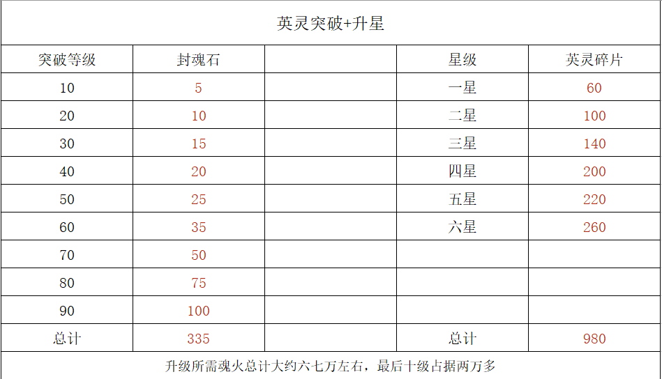
# <h1 id="机械异域">六.机械异域</h1>
目前氪金加属性和战力最划算的就是机械异域  
交谈的选项：30好感前选喜好，31到60选理想，61到100选爱情，没有该选项就点击别的界面，再回交谈刷新  
CG谈话选项哪个都行  
前几个机器人加的属性都一样，高级机器人加的属性更多，但是要的碎片也更多  
**朵拉**的约会材料数量跟其他紫色不一样，大概要多个几千，不推荐优先  
# <h1 id="逐鹿荒野">七.逐鹿荒野</h1>
主力队伍集中在一起，别分散    
如果保不住下一个段位可以干脆不上角色，晋升到下一个段位不上角色的情况下不会进行匹配，也就不会掉段  
# <h1 id="争霸战">八.争霸战</h1>
1. 争霸的一个冷门小技巧，争霸结束以后，再次点开争霸，打开自己家，可以点赞主城，有100军功，这100计算到拿红旗的5000军功里面的，有时候就差这一点拿红旗  
2. 军功邮件还可以留到下一期，这样下一期更好的拿旗子  
3. 等级随便升，洗练等满级再用，红旗以外分解可以全返，效果不挑，PVP能用就行  
# <h1 id="女神">九.女神</h1>

主战：需要升级被动技能，一般以被动跟共鸣技能评价为主
助战：需要一定等级来触发技能共鸣，以被其他女神共鸣为主

## 普通女神  

90级以内4个普通女神都一样，突破90级以后龙神打架最厉害，兽神加攻击卷资源，可以在异界换女神盒子随机碎片，千年宝库偶尔也会出  

1. 母神·女娲：  
	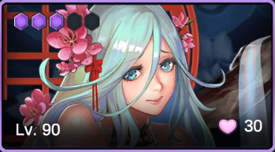  
	

2. 龙神·烛阴：  
	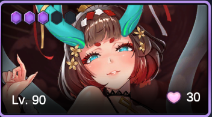  
	

3. 军神·贞德：  
	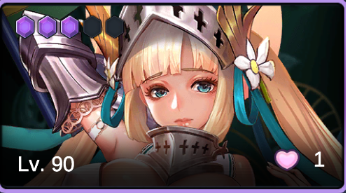  
	

4. 兽神·芙蕾雅：  
	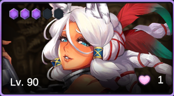  
	

## 传说女神   

1. 正义之神·奈德：  
	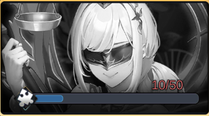  
	早期的抗压类女神，不过已有多位代替  
	推荐等级：35-150  
	主战能力一般，有其他更加强力的女神可以取代，不推荐当主女神培养  
	助战效果尚可，跟时间女神有减伤增伤效果  

2. 三上女神：  
	  
	首位传说女神，但放现在已经无力回天  
	推荐等级：35-150  
	主战能力极低，不推荐当主女神培养  
	助战效果一般，只与响神绑定  

3. 女神咏美：  
	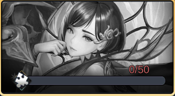  
	免疫诅咒类女神，个别情况能用，但大部分情况用不上  
	推荐等级：不推荐  
	主战能力极低，不推荐当主女神培养  
	助战效果极低，强力女神都没有他的共鸣  

4. 女神结衣：  
	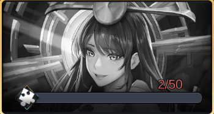  
	免疫控制类女神，个别情况能用，但没必要  
	推荐等级：不推荐  
	主战能力极低，不推荐当主女神培养  
	助战效果极低，强力女神都没有他的共鸣  

5. 破坏神悠亚：  
	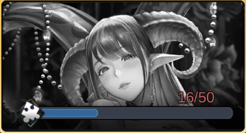  
	早期减免女神，被贯穿打废了  
	推荐等级：不推荐  
	主战能力极低，不推荐当主女神培养  
	助战效果极低，强力女神都没有他的共鸣  

6. 女神响儿：  
	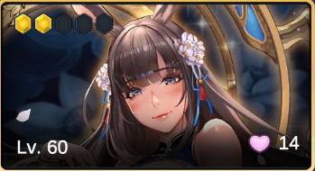  
	早期暴击爆伤兼职弱化兼职能量类女神，直到25年还没有可以能取代能量效果，因为出的早当年用的底层代码，在没有无敌程序员出手的情况下基本无视所有免疫诅咒通过三上共鸣来挂弱化效果  
	推荐等级：90-170  
	主战能力尚可，获取渠道简单，高等级时可以通过女神技获取能量提前释放大招，共鸣三上女神可以辅助部分热门角色输出  
	助战能力极低，没有强力女神需要  

7. 声乐之神咏美：  
	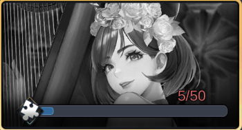  
	早期增幅类女神，但我只用来共鸣其他女神  
	推荐等级：35-不推荐  
	主战能力一般，没有其他女神来的强力  
	助战能力一般，只有惊恐神需要他  

8. 冥神·朵洛莉丝：  
	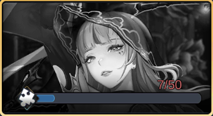  
	净化能力太快净化不了元素，非常不推荐  
	推荐等级：不推荐  
	主战能力极低，不推荐当主女神培养  
	助战效果极低，强力女神没有他的共鸣  

9. 惊恐之神·波多：  
	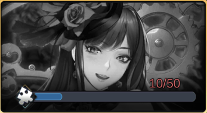  
	早期印记兼职控制类女神，不过已有代替  
	推荐等级：35-不推荐  
	主战能力一般，早期共鸣声乐的印记类女神，不过现在有更好的女神可以取代，技能三的控制效果不够稳定  
	助战能力极低，没有强力女神需要  

10. 时间之神·柯罗诺斯：  
	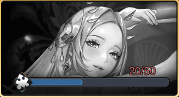  
	早期强控兼职元素增幅类女神，效果挺好的，就是直到25年了都还没有新女神可以取代  
	推荐等级：130-170  
	主战能力上佳，技能三天授类效果驱逐，把局面变成三或四打五局势，PVP方面共鸣正义神有增伤减伤攻守兼备，PVE方面共鸣商业神带来的增幅也上佳，元素讨伐期的增幅更是一骑绝尘的遥遥领先，隶属当前25年热门女神之一  
	助战能力上佳，与丰收神共鸣时可以赋予三段四种属性的元素buff，还有魔法减伤，与商业共鸣时可以增幅伤害，与150级杨梅共鸣时可以进场挂电，效果皆是上佳  

11. 黄泉女神·伊邪那美：  
	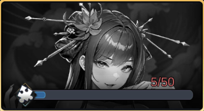  
	蓬莱专属女神，不如新女神  
	推荐等级：不推荐  
	主战能力一般，除了技能三的禁能效果没有取代能力之外其他效果皆有强力女神作为取代  
	助战效果极低，强力女神都用不上他  

12. 空间之神·杨媚：  
	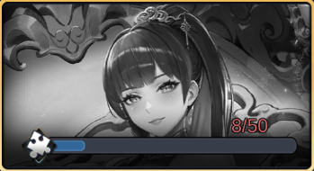  
	云国专属女神，爆发向，就是增幅不够多开始落后了  
	推荐等级：90-170  
	主战能力尚可，但在输出方面抛开云国阵营的情况下略逊后面的强力女神，正在一步一步落后中  
	助战能力一般，没几个需要他  

13. 商业之神·荷米斯：  
	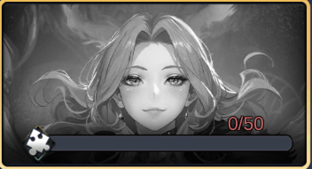  
	西方专属女神，增幅向，25年出的增幅女神还不能完全取代  
	推荐等级：90-170  
	主战能力尚可，少有的三维属性提升能力，可以提升基础攻击力类型的伤害，本身攻击力增幅也极高，增幅方面上可以叫嚣药神  
	助战能力上佳，大部分强力女神里都可以用上他  

14. 丰收女神·狄蜜特：  
	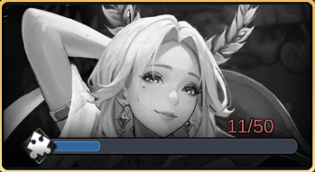  
	部落专属女神，抗压向，部落队主力  
	推荐等级：90-170  
	主战能力上佳，技能二与三都是抗压能力，在PVP方面大大提升了存活率，共鸣时间也有魔法减伤效果，共鸣商业时可以无限叠加铁卫职业的攻击，隶属25年热门女神之一  
	助战能力尚可，某位极致输出的女神需要他  

15. 海神·波色伊：  
	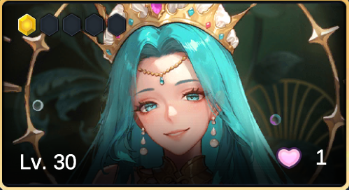  
	差点不如旧女神  
	推荐等级：35-150  
	主战能力一般，技能里带来的效果都不如其他女神  
	助战能力一般，也就个别角色的技能效果需要通过女神的共鸣来触发  

16. 命运之神·南刻：  
	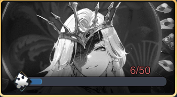  
	攻守兼备类女神，如果你有锁血角色，那么治疗恢复类能力就显得极其重要，更何况还加攻击  
	推荐等级：35-170  
	主战能力上佳，PVP与PVE双兼容，共鸣药神带来的印记能力可以取代惊恐神，隶属25年热门女神之一  
	助战效果尚可，不过几位共鸣带来的效果都中规中矩，不够破格  

17. 药神·维约维斯：  
	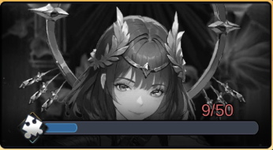  
	高额增幅类女神，PVP也可以通过共鸣来帮忙提供减伤效果  
	推荐等级：70-170  
	主战能力上佳，满配情况下总伤害增幅高达四倍增幅，选择共鸣风神时还拥有两回合的高减伤效果，隶属25年热门女神之一  
	助战能力尚可，可以跟南刻打配合  

18. 风神·飞鸾：  
	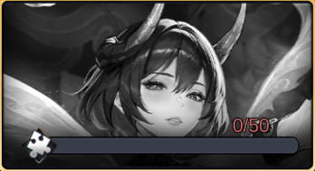  
	抗压类女神，就是技能二跟四做的一般  
	推荐等级：105-170  
	主战能力上佳，技能一可以全方位防魔法伤害，技能三也能闪避各种各样的光环效果，女神技搭配艾蕾娜或者满级貂蝉时可以免疫九成暴击伤害，不过不暴击时伤害正常，而且真伤只免疫一部分  
	助战效果尚可，跟药神时带来的减伤在PVP很显眼，不过在真伤与元素伤面前略显无力  

19. 雷神·索尔：  
	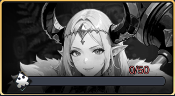  
	暴击爆伤赋能控制一体类女神，但是功能过杂增幅过低  
	推荐等级：不推荐  
	主战能力极低，当前版本暴击流弱势，并且大招的寂静也被热门女神免疫掉，增幅方面也不如药神，总体给到拉  
	助战效果极低，暴击流弱势，没人需要    

## 材料碎片
1. 女神被动升级材料  
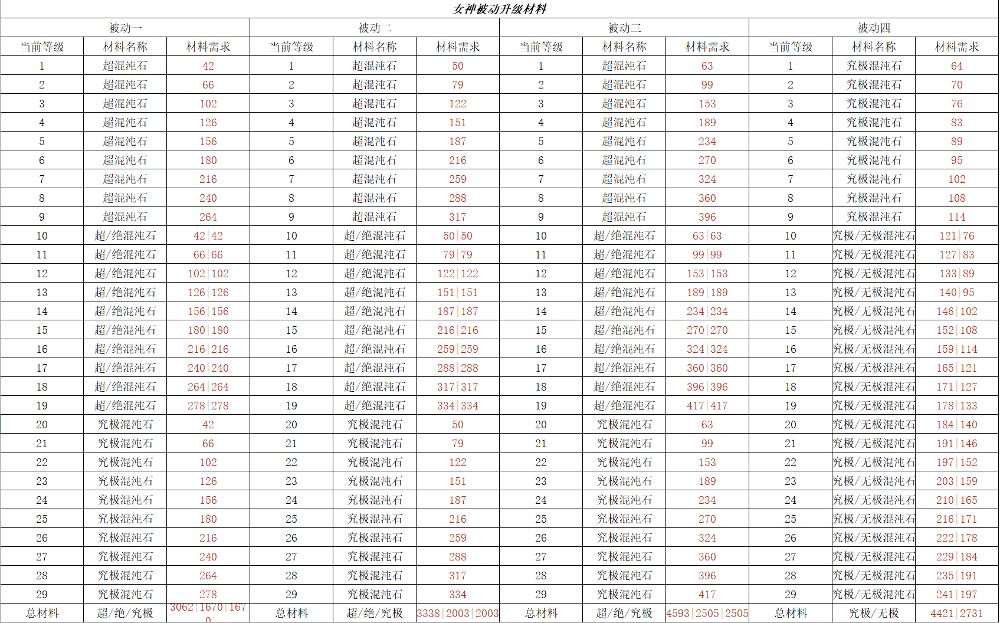

2. 女神碎片突破  
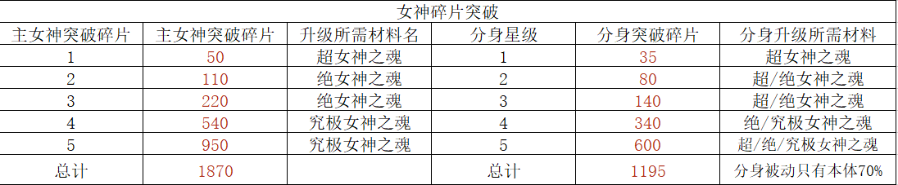

# <h1 id="专武材料">十.专武材料</h1>

1. 专武材料消耗表  
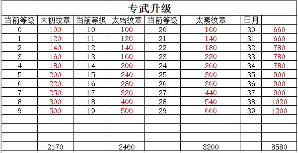

2. 推油消耗图  
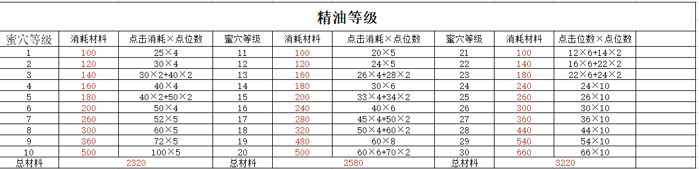

3. 觉醒材料升级表
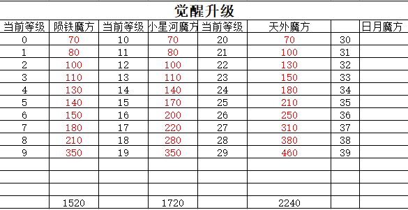

# <h1 id="游戏术语">十一.游戏术语</h1>
1. 主动技能：普通技能（每2回合发动一次）必杀技（能量满了发动）  
   常驻技能：被动技能和战场光环  
2. 游戏词条：  
   速度：每回合决定敌我行动顺序，也包括战场光环发动先后，速度一样则随机  
   命中率：决定英雄普通攻击的命中率  
   回避率：能抵消对方的命中率  
   护甲率：能抵消对方的暴击率  
3. 游戏伤害分为：  
   元素伤害：冰冻. 燃烧. 毒素. 电流. 无属性（没有备注是什么伤害，又没说物理. 魔法和真伤的就是无属性）  
   物理伤害  
   魔法伤害  
   真实伤害：不能被任何减伤. 防御效果抵消  
4. 祝福：伤害减免（提升三种伤害减伤率）. 强化（各种基础属性提升）. 免疫（不受指定效果影响）. 隐匿（不会优先成为目标）. 护卫（替队友承伤）. 圣盾（指定英雄一起承伤）. 刚盾（额外生命值）. 刺盾（反伤）. 守护（减伤）. 护盾（指定队友加额外生命值）  
5. 诅咒：受伤加深（减少三系减伤）. 弱化（各种基础属性降低）. 阻隔（是指定单位不能收到指定效果）. 印记（承受制定元素伤害）. 转移（指定角色基础属性转移到自身）. 恶堕（受伤增加）  
6. 控制：晕眩（不能行动）. 麻痹（不能普击）. 沉默（不能使用主动技能，角色1,2一般都是主动技能）. 石化（不能行动，但是物理减伤增加）. 嘲讽（强制攻击）. 停顿（不能行动）. 魅惑（指定攻击强制锁定队友）. 酩酊（使目标效果回合数延长）. 寂静（不能用主动）  
7. 补给：治疗（回血）. 恢复（回血）. 偷取（偷取目标生命或者能量给自身）. 吸收（受影响单位承伤以后恢复该伤害百分比生命）. 赋能（回能量）. 生辉（低于一定百分比，恢复生命）  
8. 消除：净化（清除指定效果）. 驱散（清除指定效果）. 减能（减少能量）. 奉献（扣除自身生命）  

# <h1 id="海岛多币路线图二">十二.海岛多币路线图二</h1>

（由奶子姐制作）  
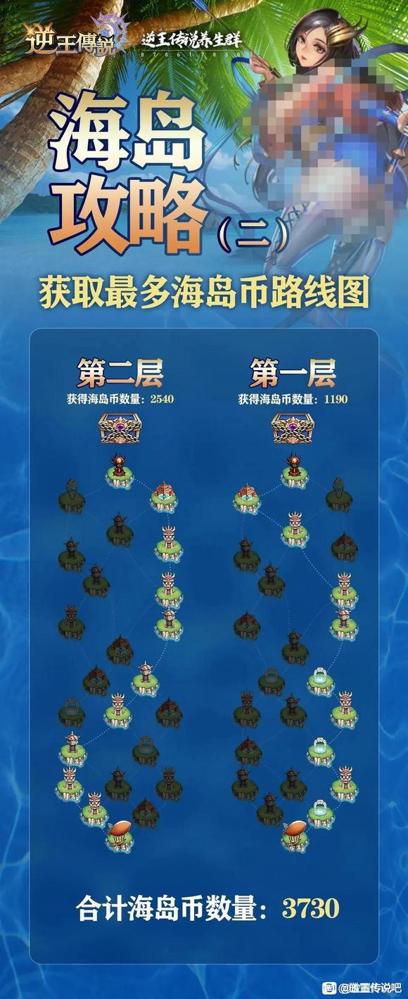

# <h1 id="机器人信物消耗">十三.机器人信物消耗</h1>

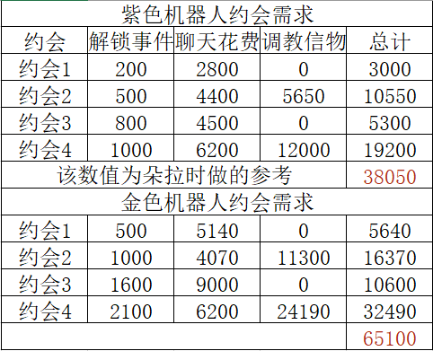  

# <h1 id="阵营英雄升星需求">十四.阵营英雄升星、升级、皮肤升级需求</h1>

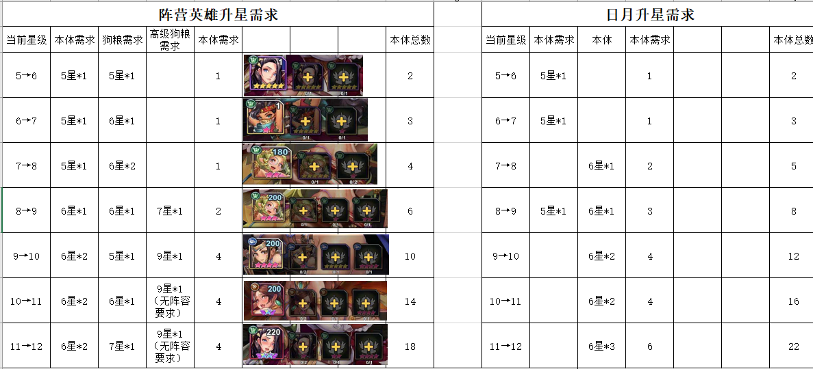  

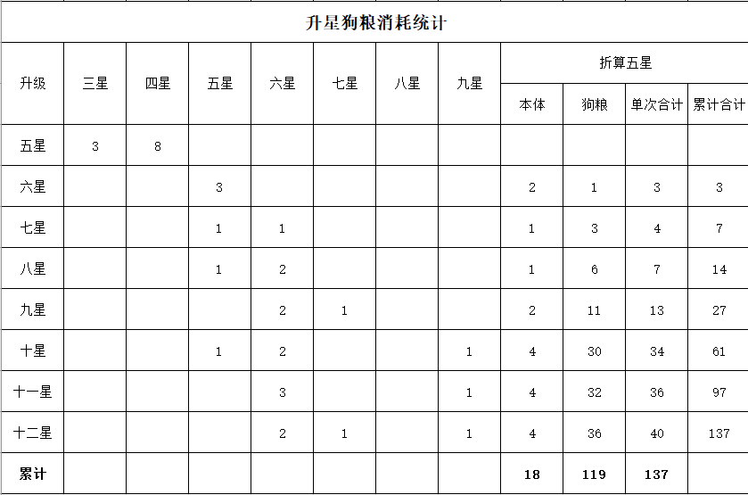  

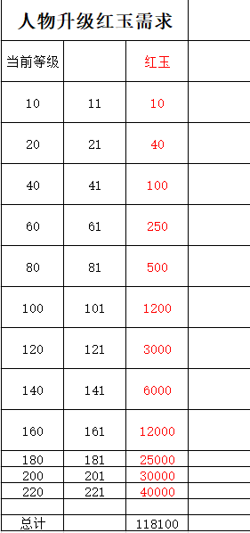  

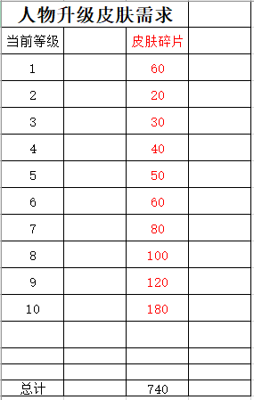  

# <h1 id="活动">十五.活动</h1>

## 异界入侵战

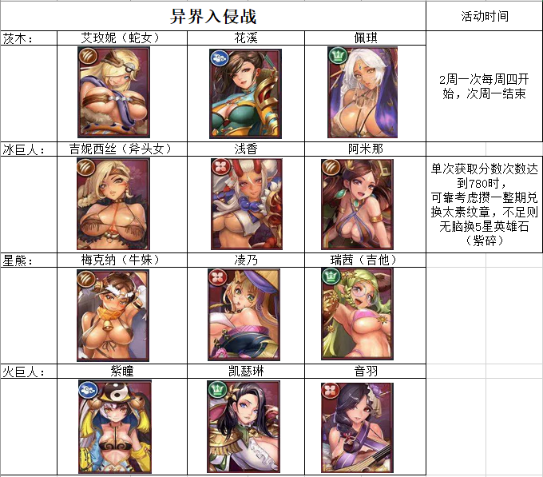  

## 神枪手祭典

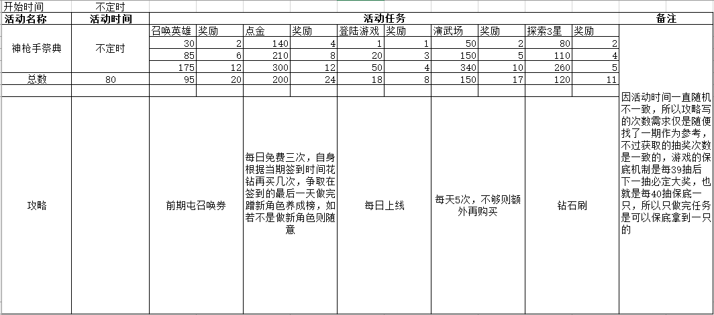  

## 枪手盛会(非酋盛会)

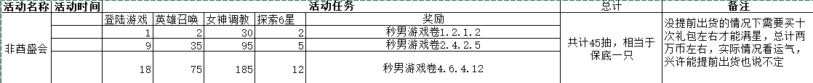  

## 许愿池
  
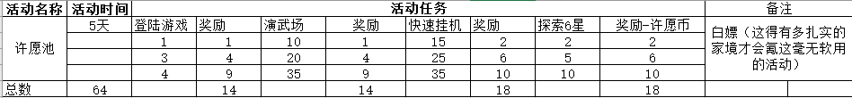  

## 千年宝库

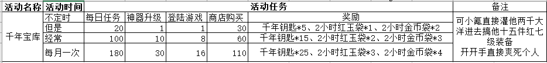  

## 调情小筑

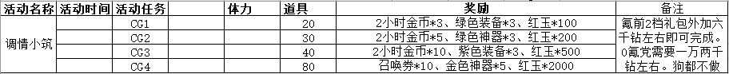  

## 调教

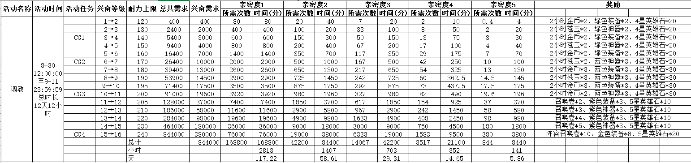  

## 酿酒

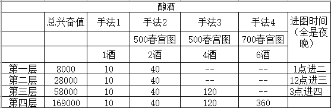  

